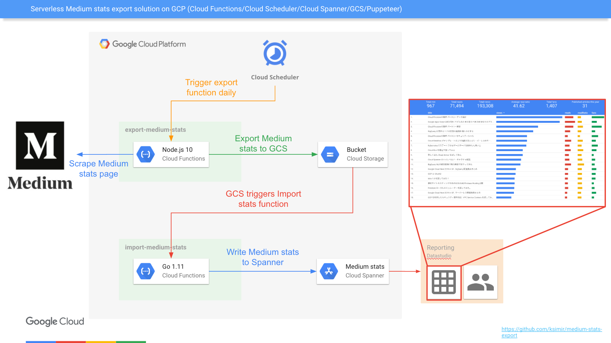

# Serverless Medium stats export
This repo contains the code for 2 functions:
- [Node.js 10] Scraping function (using Puppeteer in headless mode) to automate login and export of medium stats to GCS (CSV format)
- [Golang 1.11] Function that import the previously exported CSV to Cloud Spanner

Here is the architecture diagram of the serverless solution:


# Deployment

## Create a GCS bucket (replace [BUCKET_NAME] by an globally unique bucket name)
```
$ gsutil mb -c regional -l asia-northeast1 gs://[BUCKET_NAME]/
```

## Node.js function
Before deploying your function, update the environment variable file (.env.yaml) with your own medium login information, the bucket name you just creaed as well as the recovery email address of your google account used to login to Medium.

Then run the following command
```
$ gcloud functions deploy exportMediumStats --runtime nodejs10 --trigger-http --env-vars-file .env.yaml --region asia-northeast1 --memory 2048MB --timeout 540s
```

Remember the httpsTrigger:url that is returned by the gcloud command.

## Golang function
Before deploying your function, update the environment variable file (.env.yaml) with your own Spanner instance/datatbase.

Then create a Cloud Spanner instance as well as a new database. For more details, please refer the this [document](https://cloud.google.com/spanner/docs/quickstart-console).

Now we need to create 2 tables using the following DDL statements:

stats table:
```
CREATE TABLE stats (
    id STRING(MAX) NOT NULL,
    fans INT64 NOT NULL,
    lastUpdateTime TIMESTAMP OPTIONS (allow_commit_timestamp=true),
    link STRING(MAX) NOT NULL,
    liveDate DATE NOT NULL,
    mins INT64 NOT NULL,
    pubDate DATE NOT NULL,
    publication STRING(MAX),
    readRatio FLOAT64 NOT NULL,
    reads INT64 NOT NULL,
    title STRING(MAX),
    views INT64 NOT NULL,
) PRIMARY KEY (id)
```

readview_history:
```
CREATE TABLE readview_history (
    id STRING(MAX) NOT NULL,
    updateTime DATE NOT NULL,
    reads INT64 NOT NULL,
    views INT64 NOT NULL,
) PRIMARY KEY (id, updateTime DESC),
INTERLEAVE IN PARENT stats ON DELETE CASCADE
```

Finally run the following command
```
$ gcloud functions deploy GCStoSpanner --runtime go111 --trigger-bucket medium-stats --env-vars-file .env.yaml --region asia-northeast1 --memory 256MB --timeout 60s
```

## Cloud Scheduler
You want to export stats from Medium on a regular basis, let's say once a day. To do so, GCP offers a product called [Cloud Scheduler](https://cloud.google.com/scheduler/docs/) that can trigger an HTTP endpoint at a defined schedule.

In the following command, replace [URI] by the URL you got [here](#nodejs-function)
```
$ gcloud scheduler jobs create http medium-daily-export --schedule "0 8 * * *" --uri [URI] --http-method POST
```
